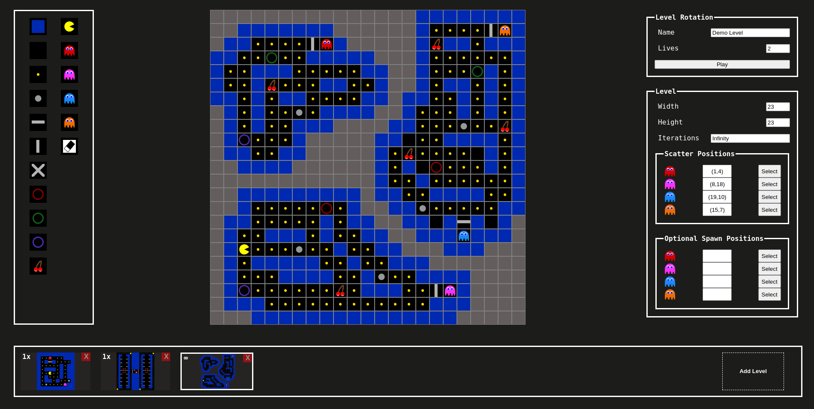
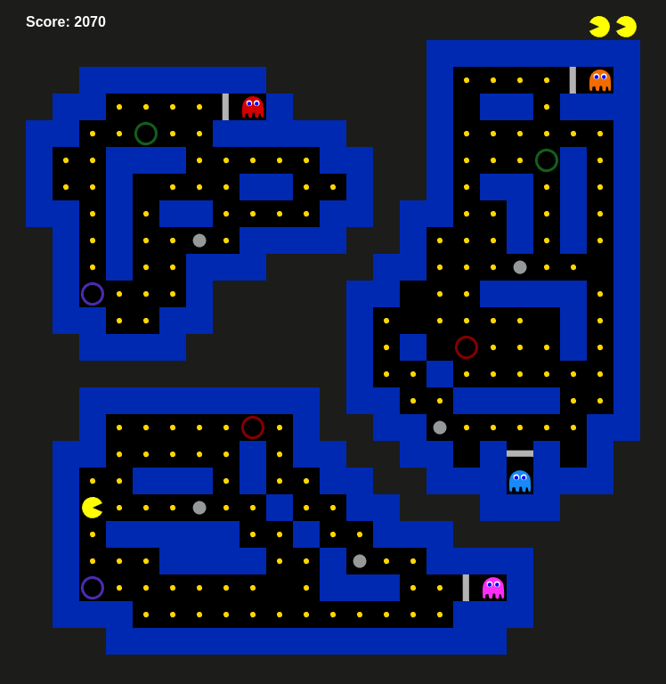

## About this project
This is an attempt to build a variant of the game pacman using HTML, CSS and JavaScript for training purposes.

 

The game currently offers the following features:

* play default level based on the original level layout
* create custom level rotation
* save custom level rotations in your browser
* play, change and delete custom level rotations
 
 

The movement patterns of the ghosts and other aspects are only loosely based on the original game, so do not expect the same behavior.

 

  

Default Level

 

  

Level Editor

 

  

Custom Level

 

## Current Status
Work in progress

 

## How to play
Play the game via [github-pages](https://voss29.github.io/pacman/). 

 

You can also upload this project to a webserver. Since the codebase includes module files (extension _.mjs_) you may need to configure it to use _Content-Type: text/javascript_. [More Information](https://v8.dev/features/modules#mjs) 

 

## External programs and resources used
* [The Pac-Man Dossier](https://pacman.holenet.info/) by Jamey Pittman for information about the original game
* [Inkscape](https://inkscape.org/) for creating svg sprites
* [Online SVG Converter](https://svg-converter.com/minify) for minifying svg sprites
  
 

## Ideas for improvements and additional features
 

#### General
- [ ] make project responsive
- [ ] make game usable on mobile devices
- [ ] add instruction page
- [ ] add about page
- [ ] improve notification about victory and defeat
- [ ] add documentation with class diagrams
- [ ] add tests
- [ ] improve css styling
 

#### Game
- [ ] implement point value multiplicator for consumption of multiple scared ghosts
- [ ] add sound effects for actors
- [ ] add level theme song
- [ ] add ability to mute game
- [ ] add spawn stack for respawning multiple ghosts of the same type
 

#### Canvas
- [ ] fix sprite display priority between moving and respawning ghosts
- [ ] add level counter with bonus element sprites
- [ ] draw value of earned points as text on canvas after point, powerup, bonus and scared ghost consumption
- [ ] add death animation for pacman
- [ ] add start screen before starting level
- [ ] add graphic transfer between different levels
- [ ] add game over screen displaying statistics
- [ ] add sprite priority checks to prevent actor sprites from overwriting actor sprites of higher priority
 

#### ConsoleView
- [ ] add console view for logging 
- [ ] add ability to toggle console view
 

#### Level Editor
- [ ] add ability to rearrange level order in rotation
- [ ] add ability to copy level rotation string to clipboard
 

#### Database
- [x] add indexedDB
- [x] store and show level rotations
- [x] load level rotations to game
- [x] load level rotations to editor
- [x] delete level rotations
- [ ] load level rotation string to database

 

## Version history
 

#### Version 0.08
* add support for database indexedDB
  * save level rotation
  * query level rotation
  * delete level rotation
* add site listing all saved level rotations
  * preview slider for all level in level rotation
  * load level rotation in editor
  * play level rotation
  * delete level rotations
* add two demo levels to select and edit
 

#### Version 0.07
* add level rotation
* add option to pause game
* add features to level editor
  * add name for level rotation
  * add level to rotation
  * add iteration of each level within rotation
  * add ability to delete level from rotation
  * add ability to switch between levels
  * add level preview in icon
  * add eraser tool
  * add basic validation for all levels in rotation
* refactor codebase for level editor
 

#### Version 0.06
* replace div-based game screen with canvas
* replace png sprites with svg sprites
* replace deprecated KeyboardEvent.keyCode
* add animations for pacman and ghost movement
* add animation for transition between ghost states scared and scatter
* add animation for ghost respawn
* add sprite counter for number of remaining lifes
* refactor codebase
* fix bugs
 

#### Version 0.05
* add bonus element
* implement chase pattern for ghost pinky
* implement chase pattern for ghost clyde
* implement chase pattern for ghost inky
 

#### Version 0.04
* add visual level editor with basic functions:
    * set width and height
    * add actors and elements
    * set scatter positions for ghosts
    * set optional spawn positions for ghosts
    * send and parse custom level
 

#### Version 0.03
* add powerups
* add ghost doors (only accessible by ghosts)
* add movement states for ghosts:
  * Chase: chase closest pacman on the shortest path (chase pattern for ghost Blinky)
  * Scatter: move to scatter position on the shortest path and wait there until state changes
  * Scared: move randomly upon consumption of a powerup by pacman
  * Dead: move to spawn position on the shortest path
  * Respawn: wait until state changes
* add sprites for movement state scared
* add sprites for movement state dead
* add sprites for movement state respawn
* add sprites for bonus elements
 

#### Version 0.02
* adjust sprites of pacman and ghosts to their current direction of movement
* add teleporter tiles
* implement collision handling for pacmans
* implement collision handling for ghosts
 

#### Version 0.01
* build basic level from user input
* implement basic pacman behavior
  * move in four directions
  * stop on wall collision
  * consume points 
* implement basic ghost behavior
  * chase pacman on the shortest path
  * decrement pacmans health on collision
* display game on HTML-site 
* notify player about victory (no points left)
* notify player about defeat (no lifes left)